# Projet - Analyseur syntaxique et interpréteur pour PCF

## PCF Vert

### Test de priorité des opérations

Vérifie que la multiplication passe bien avant l'addition.
```
2 + 4 * 10
```
Résultat attendu : `42`.

Capture du fonctionnement de l'outil Antlr pour PCF Vert avec l'aperçu de l'arbre syntaxique généré :
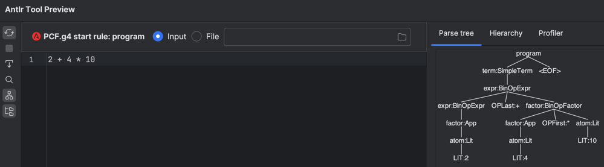

Capture du fonctionnement de l'interpréteur PCF Vert avec l'évaluation de l'expression de priorité :
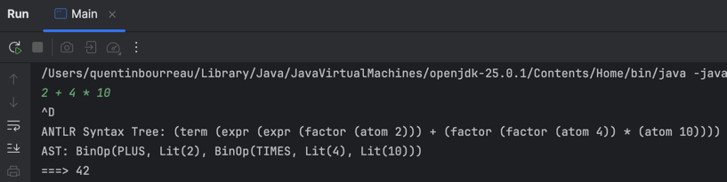


### La conditionnelle calculée

Vérifie que le `ifz` (si zéro) fonctionne avec un calcul dans le test.
```
ifz 10 - 10 then 1 else 0
```
Résultat attendu : `1`.

Capture du fonctionnement de l'outil Antlr pour PCF Vert avec l'aperçu de l'arbre syntaxique généré :
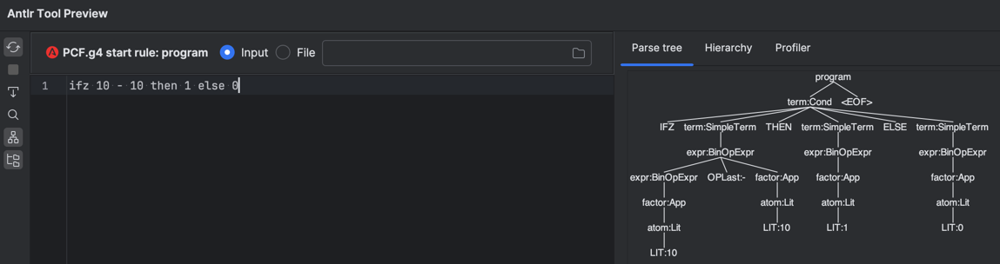

Capture du fonctionnement de l'interpréteur PCF Vert avec l'évaluation de l'expression conditionnelle :


### Le Mix (Imbrication)

Vérifie qu'on peut faire des maths dans une condition.
```
ifz 0 then (5 + 5) * 2 else 500
```
Résultat attendu : `20`.

Capture du fonctionnement de l'outil Antlr pour PCF Vert avec l'aperçu de l'arbre syntaxique généré :
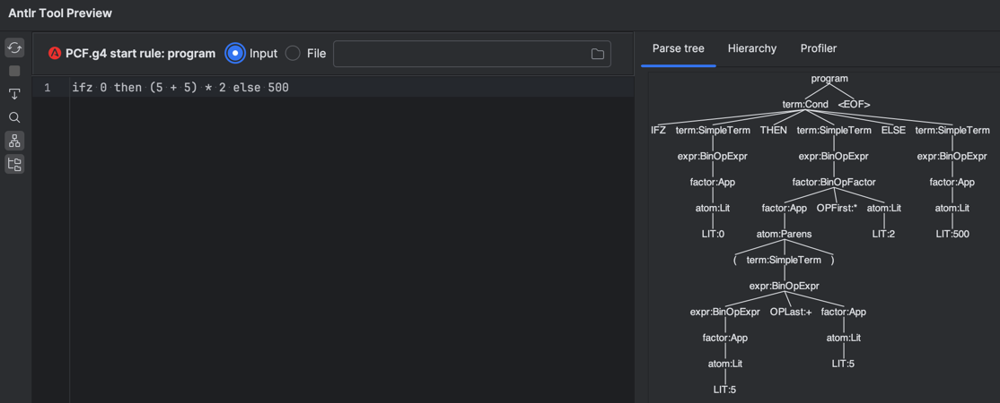

Capture du fonctionnement de l'interpréteur PCF Vert avec l'évaluation de l'expression mixte :
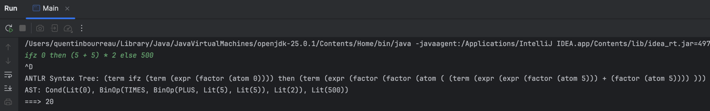

---

## PCF Bleu

### Test de portée des variables

Vérifie que les variables respectent bien leur portée.
```
let x = 1 in
(let x = x + 1 in x) + x
```
Résultat attendu : `3`.

Capture du fonctionnement de l'outil Antlr pour PCF Bleu avec l'aperçu de l'arbre syntaxique généré :
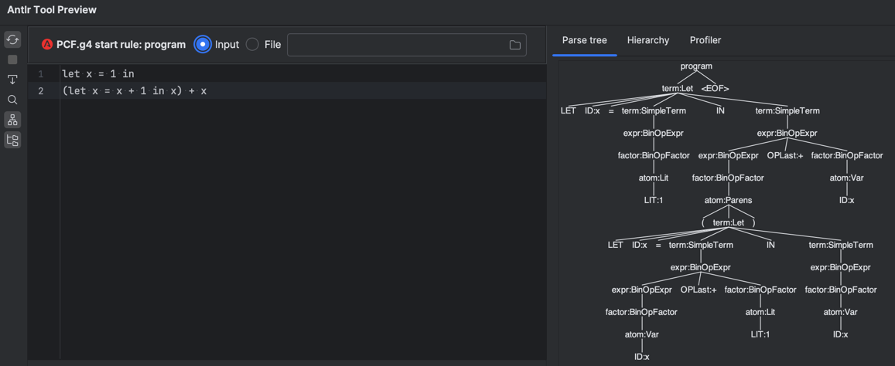

Capture du fonctionnement de l'interpréteur PCF Bleu avec l'évaluation de l'expression de portée des variables :
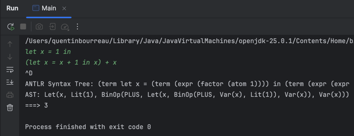

---

## PCF Rouge

### Test 1 : Fonction simple

```
fun x -> 0
```
Résultat attendu : `(fun x -> 0)`


### Test 2 : Addition avec fonction (Parenthèses obligatoires !)

```
1 + (fun x -> 0)
```
Résultat attendu : `Erreur (ClassCastException) car on ne peut pas additionner 1 (int) et une Closure.`

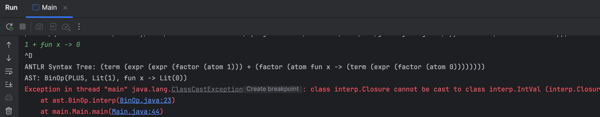

### Test 3 : Identité

```
fun x -> x + 1
```
Résultat attendu : `(fun x -> x + 1)`

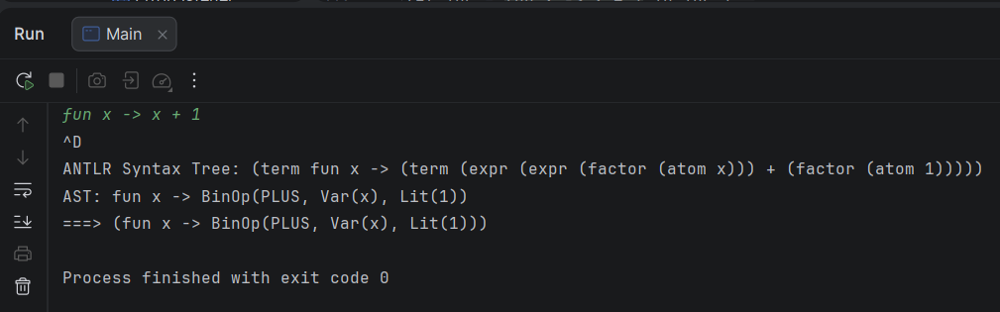

### Test 4 : Application simple

```
let z = fun x -> 0 in z 1
```
Résultat attendu : `0`

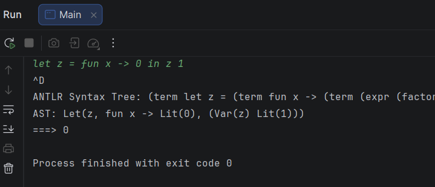

### Test 5 : Application fonctionnelle

```
let z = fun x -> 0 in z (fun x -> 0)
```
Résultat attendu : `0`

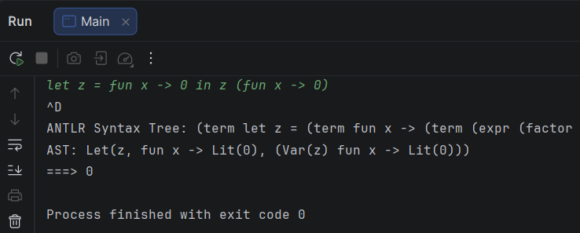

### Test 6 : Incrément

```
let inc = fun x -> x + 1 in inc 1
```
Résultat attendu : `2`

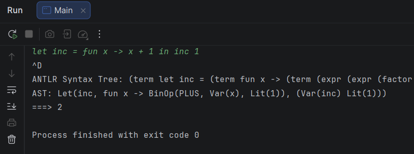

### Test 7 : Currying

```
let add = fun x -> fun y -> x + y in let inc = add 1 in inc 2
```
Résultat attendu : `3`
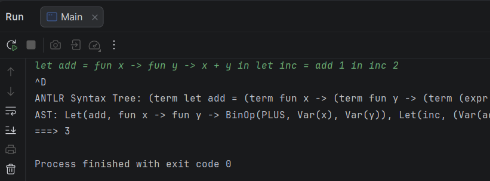
---

FIL A1 - 2025/2026

BOURREAU Quentin / KOWALSKI Damien